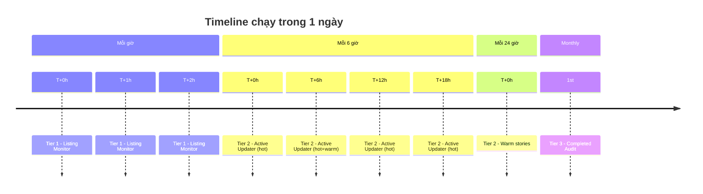
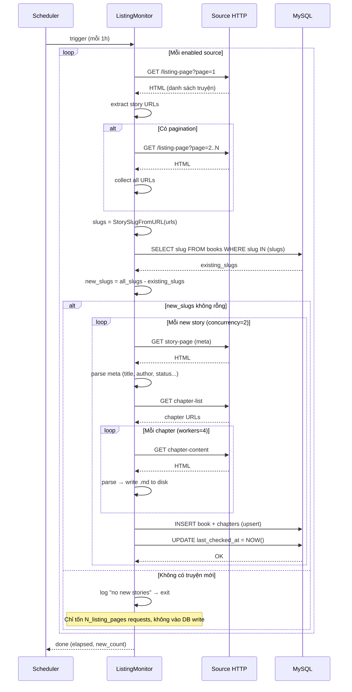
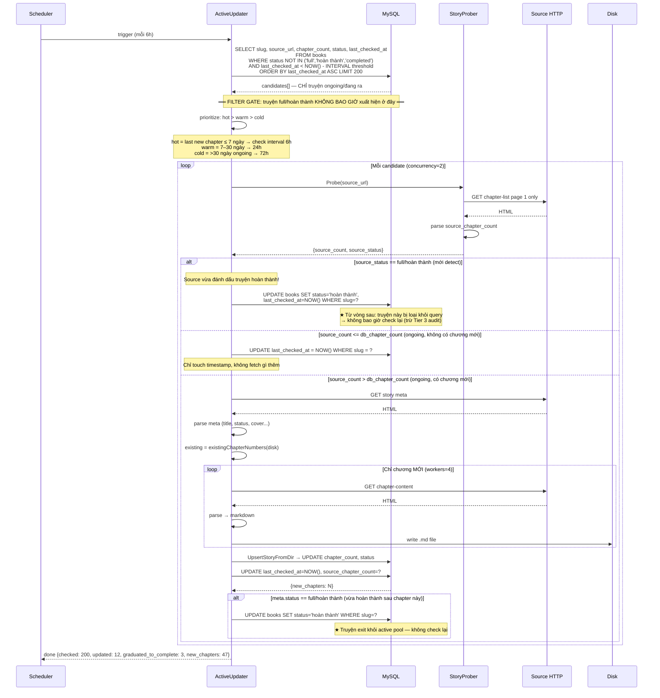
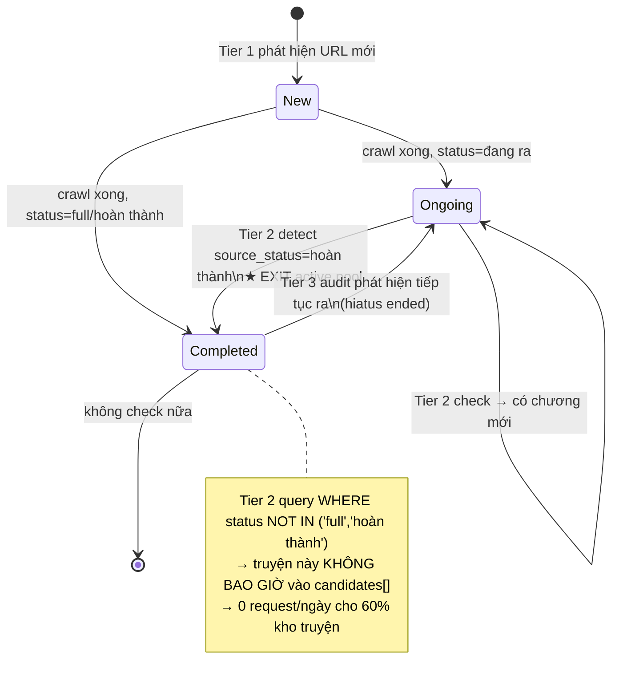
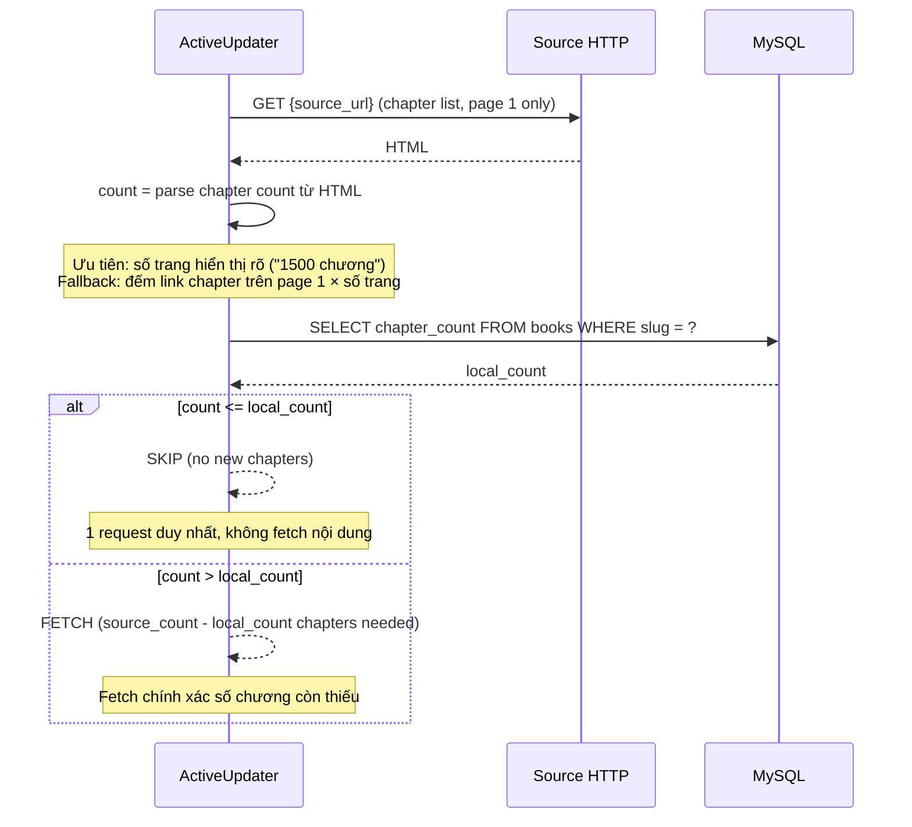
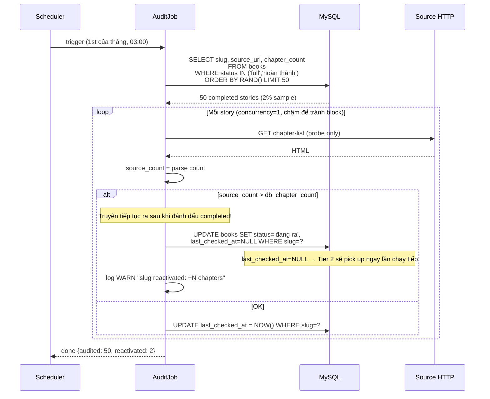
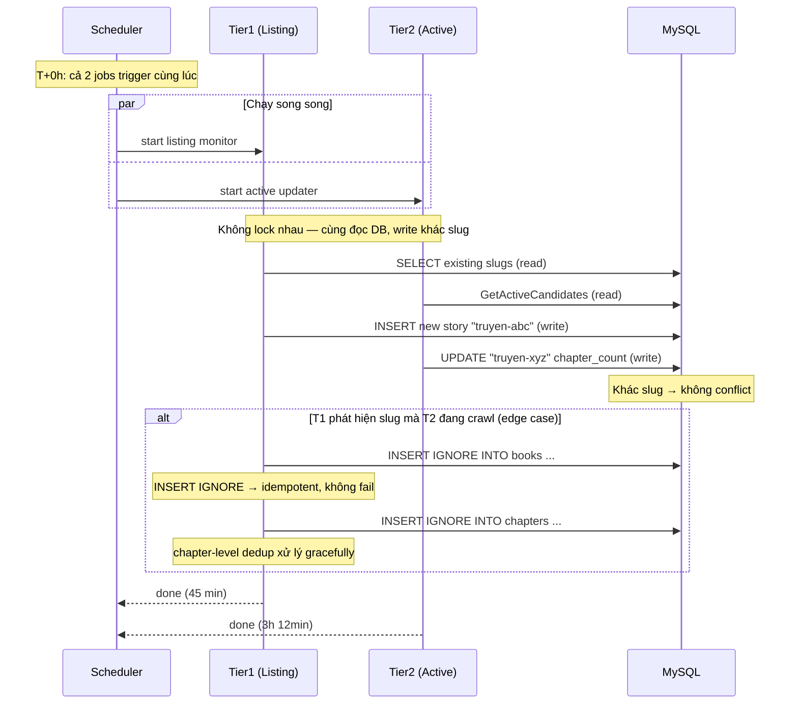

# Crawl Job Sequences — Tối ưu 3-Tier

**Liên quan**: [incremental-crawl-strategy.md](./incremental-crawl-strategy.md)  
**Date**: 2026-05-12

---

## Tổng quan scheduler



---

## Sequence 1 — Tier 1: Listing Monitor

> **Mục tiêu**: phát hiện truyện URL mới trên listing page, KHÔNG re-crawl existing.  
> **Chi phí**: cố định, không phụ thuộc số truyện trong DB.



**Số request điển hình** (không có truyện mới):
```
1 source × 10 listing pages = 10 requests
12 sources × 10 pages = 120 requests/giờ  ← cố định
```

---

## Sequence 2 — Tier 2: Active Updater (per run)

> **Mục tiêu**: check truyện `ongoing` có chương mới không, chỉ fetch nếu có.  
> **Key optimization**: "probe before fetch" — so sánh chapter count trước, tránh fetch nội dung thừa.  
> **⚠️ Truyện `full`/`hoàn thành` bị loại ngay tại bước query — không bao giờ vào vòng lặp.**



---

## Lifecycle truyện "full" — Tại sao không check lại



**Hai con đường truyện vào trạng thái `Completed`**:

| Con đường | Trigger | Ai xử lý |
|-----------|---------|----------|
| Source đánh dấu "full" ngay khi crawl lần đầu | `meta.status == full` lúc INSERT | Tier 1 Listing Monitor |
| Source đánh dấu "full" sau N chương cuối | `source_status == full` trong probe | Tier 2 Active Updater |

**SQL filter gate** — hàng rào bắt buộc trong `GetActiveCandidates`:

```sql
SELECT slug, source_url, chapter_count, last_checked_at
FROM books
WHERE status NOT IN ('full', 'hoàn thành', 'completed', 'đã hoàn thành')
  AND last_checked_at < DATE_SUB(NOW(), INTERVAL ? SECOND)
ORDER BY last_checked_at ASC
LIMIT ?;
```

> Index `idx_check_priority (status, last_checked_at)` đảm bảo query này O(ongoing_count) chứ không phải O(total_books).

---

## Sequence 3 — Probe optimization chi tiết

> Flow trong `StoryProber.Probe()` — bước quyết định có crawl hay không.



**So sánh số request**:

| Scenario | Cũ (recrawl_existing) | Mới (probe first) |
|----------|----------------------|-------------------|
| Truyện không có chương mới | meta(1) + chap-list(5+) + content(0) = **6+ req** | probe(1) = **1 req** |
| Truyện có 5 chương mới | meta(1) + chap-list(5) + content(5) = **11 req** | probe(1) + meta(1) + content(5) = **7 req** |

---

## Sequence 4 — Tier 3: Monthly Audit

> Spot-check truyện "completed" để phát hiện tiếp tục ra sau hiatus.



---

## Sequence 5 — Tương tác 3 tiers trong 1 ngày (collision handling)



---

## Priority Queue Logic cho Tier 2

```
Candidates sorted by urgency score:

score = (hours_since_last_check / check_interval) × recency_weight

where:
  check_interval = 6h   if days_since_new_chapter <= 7   (hot)
  check_interval = 24h  if days_since_new_chapter <= 30  (warm)  
  check_interval = 72h  if days_since_new_chapter > 30   (cold ongoing)

  recency_weight = 1.5  if new chapter in last 24h (very hot)
                = 1.0   otherwise

Score > 1.0 → overdue → process first
Score < 1.0 → not yet due → skip
```

**Ví dụ** (`limit=200` candidates/run):
```
Run T+6h:
  hot stories (7 ngày):  1500 × 30% = 450 → overdue ~150  ← lấy hết
  warm stories (30 ngày): 500 × 25% = 125                  ← lấy ~50
  cold ongoing:           300 × 8%  =  24                  ← lấy hết
  Total: ~224 → cap ở 200
```

---

## Tóm tắt request budget

| Job | Tần suất | Requests/run | Requests/ngày |
|-----|----------|-------------|---------------|
| Tier 1 Listing Monitor | 24×/ngày | ~120 (fixed) | **~2.880** |
| Tier 2 Active Updater | 4×/ngày | ~200 probes + ~50 full fetches | **~1.400** |
| Tier 3 Audit | 1×/tháng | ~50 | ~2/ngày |
| **Tổng** | | | **~4.280/ngày** |
| **Cũ (recrawl_existing)** | | | **~50.000+/ngày** |
| **Giảm** | | | **~91%** |
