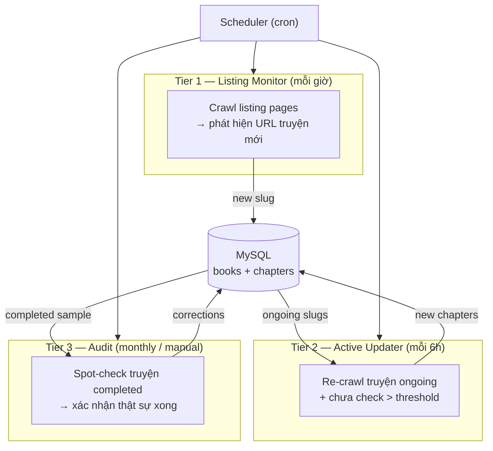

# Incremental Crawl Strategy — Post Full-Data Phase

**Status**: Proposed  
**Date**: 2026-05-12  
**Context**: Sau khi đã crawl xong toàn bộ kho truyện, cần chiến lược hiệu quả để duy trì dữ liệu mới mà không lãng phí tài nguyên.

---

## Vấn đề hiện tại

`recrawl_existing=true` trong continuous mode re-check **tất cả** truyện mỗi vòng:

```
Pass N: 5.000 truyện × (listing HTTP + meta HTTP + chapter-list HTTP) = hàng chục nghìn requests
→ 99% truyện không có chương mới → wasted
→ Truyện đã "hoàn thành" cũng bị check → vô nghĩa
```

**Root cause**: không có sự phân biệt giữa truyện đang ra × truyện hoàn thành × truyện mới.

---

## Phân tích tải

| Loại truyện | Tỉ lệ ước tính | Tần suất cần check |
|-------------|----------------|-------------------|
| Đang ra chương (ongoing) | ~30% | Hàng ngày |
| Vừa hoàn thành (< 30 ngày) | ~10% | Weekly |
| Hoàn thành lâu (> 30 ngày) | ~60% | Không cần |

→ Chỉ cần check **40%** tổng số truyện mỗi ngày, giảm 60% request.

---

## Kiến trúc đề xuất: 3-Tier Crawl



### Tier 1 — Listing Monitor
- **Nhiệm vụ**: chỉ crawl trang listing (danh sách), so sánh URL với `books.slug` đã có
- **Chi phí**: O(số trang listing) — thường 5–20 trang/source, cố định
- **Tần suất**: mỗi 1 giờ
- **Output**: danh sách slug mới → đẩy vào crawl queue

### Tier 2 — Active Updater
- **Nhiệm vụ**: re-crawl truyện có `status != completed` và `last_checked_at > N giờ`
- **Chi phí**: O(ongoing_stories) — ~30% tổng
- **Tần suất**: mỗi 6 giờ
- **Logic ưu tiên**:
  - Hot (< 7 ngày kể từ chapter mới nhất): check mỗi 6h
  - Warm (7–30 ngày): check mỗi 24h
  - Cold (> 30 ngày, còn ongoing): check mỗi 72h

### Tier 3 — Audit
- **Nhiệm vụ**: spot-check ngẫu nhiên 1–5% truyện completed mỗi tháng
- **Mục đích**: phát hiện truyện source đánh sai status / tiếp tục ra sau hiatus
- **Tần suất**: monthly hoặc manual trigger

---

## DB Changes

Thêm 2 cột vào `books`:

```sql
ALTER TABLE books
    ADD COLUMN last_checked_at  DATETIME     NULL     COMMENT 'Lần cuối crawl check chương mới',
    ADD COLUMN source_chapter_count INT       NULL     COMMENT 'Số chương theo source listing (nếu có)',
    ADD INDEX  idx_check_priority (status, last_checked_at);
```

**Không thay đổi** cột `status` hiện có — tiếp tục dùng giá trị `'full'`/`'hoàn thành'`/`'đang ra'` từ scrape.

---

## Code Changes

### 1. Config — thêm crawl mode per source

```json
// scrape_sources.json
{
  "sources": [
    {
      "url": "https://truyencom.com/truyen-tien-hiep/full/",
      "crawl_mode": "listing_only",   // chỉ check listing để tìm slug mới
      "enabled": true
    }
  ],
  "active_updater": {
    "enabled": true,
    "interval_hours": 6,
    "hot_threshold_days": 7,
    "warm_threshold_days": 30
  }
}
```

`crawl_mode`:
- `listing_only` — chỉ detect URL mới, không re-crawl existing (Tier 1)
- `full` — crawl toàn bộ kể cả existing (mode hiện tại, dùng lúc bootstrap)
- `active_only` — chỉ crawl truyện ongoing (Tier 2, run độc lập)

### 2. Crawler — tách `RunListingOnly` khỏi `RunSource`

```go
// RunListingOnly chỉ fetch listing → filter new slugs → crawl chúng.
// Không động đến truyện đã có trong DB.
func (c *Crawler) RunListingOnly(ctx context.Context, src config.ScrapeSource) error { ... }

// RunActiveUpdate fetch chapter mới cho ongoing stories.
// Query DB lấy candidates, không đụng đến listing pages.
func (c *Crawler) RunActiveUpdate(ctx context.Context, cfg config.ActiveUpdaterConfig) error { ... }
```

### 3. DB — query candidates cho Tier 2

```sql
-- Candidates cho Active Updater
SELECT slug, source_url, status, last_checked_at
FROM books
WHERE status NOT IN ('full', 'hoàn thành', 'completed')
  AND (
      last_checked_at IS NULL
      OR (
          -- hot: check mỗi 6h
          DATEDIFF(NOW(), last_checked_at) <= 7  AND last_checked_at < DATE_SUB(NOW(), INTERVAL 6 HOUR)
          OR
          -- warm: check mỗi 24h
          DATEDIFF(NOW(), last_checked_at) BETWEEN 7 AND 30 AND last_checked_at < DATE_SUB(NOW(), INTERVAL 24 HOUR)
          OR
          -- cold ongoing: check mỗi 72h
          DATEDIFF(NOW(), last_checked_at) > 30  AND last_checked_at < DATE_SUB(NOW(), INTERVAL 72 HOUR)
      )
  )
ORDER BY last_checked_at ASC
LIMIT ?;
```

### 4. Cập nhật `last_checked_at` sau mỗi crawl

Trong `UpsertStoryFromDir` (hoặc sau khi gọi nó trong crawler):

```go
_, err = tx.Exec(
    "UPDATE books SET last_checked_at = NOW() WHERE id = ?",
    bookID,
)
```

---

## Schedule Configuration

```json
{
  "schedule": {
    "type": "multi",
    "jobs": [
      {
        "name": "listing_monitor",
        "interval_minutes": 60,
        "mode": "listing_only"
      },
      {
        "name": "active_updater",
        "interval_hours": 6,
        "mode": "active_only"
      },
      {
        "name": "monthly_audit",
        "cron": "0 3 1 * *",
        "mode": "audit",
        "sample_pct": 2
      }
    ]
  }
}
```

---

## ADR-001: Tier-based Crawl Instead of Full Recrawl

**Status**: Proposed

**Context**: Sau phase đầu (full crawl), việc re-check toàn bộ 5.000+ truyện mỗi vài giờ gây lãng phí request ~60x so với cần thiết. Source site có thể rate-limit hoặc block.

**Decision**: Tách crawler thành 3 tier độc lập. Tier 1 chạy thường xuyên nhưng rất nhẹ (chỉ listing). Tier 2 chạy ít hơn, chỉ với tập con có khả năng cập nhật.

**Alternatives Considered**:
- **Full recrawl mãi**: đơn giản nhất nhưng scale kém, dễ bị block
- **Webhook từ source**: lý tưởng nhưng source không hỗ trợ
- **RSS/sitemap**: source không có

**Consequences**:
- (+) Giảm 60–80% số HTTP request
- (+) Giảm nguy cơ bị rate-limit/block
- (+) Dễ scale khi thêm source
- (−) Code phức tạp hơn (2 code path thay vì 1)
- (−) Cần migration DB (2 cột mới)

---

## ADR-002: last_checked_at ở DB thay vì file system

**Status**: Proposed

**Context**: Cần track khi nào từng truyện được check lần cuối để quyết định có re-crawl không.

**Decision**: Thêm `last_checked_at DATETIME` vào bảng `books`.

**Alternatives Considered**:
- **File mtime**: không reliable qua container restart
- **Redis TTL**: thêm dependency, không persistent qua restart
- **Separate tracking table**: overkill cho use case này

**Consequences**:
- (+) Persistent, dễ query với index
- (+) Không thêm dependency mới
- (−) Cần ALTER TABLE migration

---

## Rollout Plan

### Giai đoạn 1 — DB migration (1 ngày)
```sql
ALTER TABLE books
    ADD COLUMN last_checked_at DATETIME NULL,
    ADD COLUMN source_chapter_count INT NULL,
    ADD INDEX idx_check_priority (status, last_checked_at);

-- Backfill: mark tất cả existing đã checked 1 ngày trước
UPDATE books SET last_checked_at = DATE_SUB(NOW(), INTERVAL 1 DAY);
```

### Giai đoạn 2 — Code: tách RunListingOnly (3–5 ngày)
- Implement `RunListingOnly` trong crawler
- Update `last_checked_at` sau mỗi `crawlStory`
- Unit test với mock DB

### Giai đoạn 3 — Code: RunActiveUpdate + query candidates (3–5 ngày)
- Implement `RunActiveUpdate`
- Implement `GetActiveCandidates` trong db package
- Integrate vào scheduler

### Giai đoạn 4 — Config & scheduler multi-job (2–3 ngày)
- Extend `ScrapeConfig` support multi-job schedule
- Deploy, monitor request count vs trước

### Giai đoạn 5 — Monthly audit (optional, sau 1 tháng)
- Implement sau khi Tier 1 + 2 ổn định

---

## Metrics để validate

| Metric | Trước | Target sau |
|--------|-------|-----------|
| HTTP requests/ngày | ~50.000 | < 10.000 |
| Stories checked/ngày | 5.000 | ~1.500 |
| Chapters mới detect latency | 0–6h | < 2h (hot) / < 24h (warm) |
| Source block incidents | ? | 0 |
